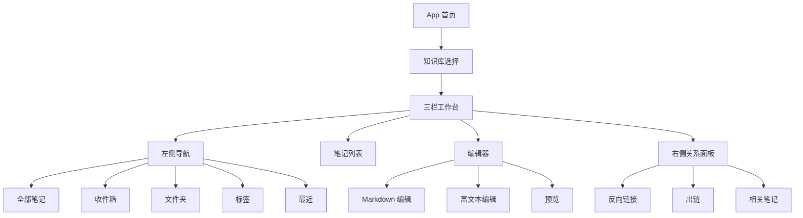

# 高保真 UCD 设计 v0.1

## 1. 设计目标
打造一个 macOS 风格、简洁清晰、以内容为中心的笔记与知识库软件。界面不追求“功能很多”，而追求用户每天打开都知道下一步该做什么。

## 2. 信息架构



## 3. 关键用户流程

### 3.1 首次使用
1. 打开 App。
2. 选择“创建知识库”或“打开已有知识库”。
3. 选择本地目录或 NAS 挂载目录。
4. App 自动创建基础目录与索引。
5. 进入工作台，默认打开“收件箱”。

### 3.2 快速写笔记
1. 点击左上角新建按钮。
2. 自动创建无标题笔记。
3. 光标进入标题。
4. 用户输入标题和正文。
5. 系统自动保存。

### 3.3 引用另一篇笔记
1. 用户在正文输入 `[[`。
2. 弹出笔记搜索浮层。
3. 输入关键词筛选。
4. 回车插入引用。
5. 右侧关系面板更新出链。

### 3.4 查找知识
1. 用户按 `Cmd/Ctrl + K`。
2. 打开全局搜索。
3. 输入关键词。
4. 结果按标题、正文、标签分组。
5. 选择结果后进入对应笔记并高亮命中片段。

## 4. 桌面端高保真界面

### 4.1 主工作台

```text
┌────────────────────────────────────────────────────────────────────────────┐
│  ● ● ●  知识库名称                           搜索...        同步状态  设置 │
├───────────────┬─────────────────────┬─────────────────────────┬────────────┤
│  + 新建        │  收件箱              │  标题：Vibe Coding 学习   │  反向链接   │
│               │  ─────────────────   │                         │            │
│  全部笔记      │  Vibe Coding 学习     │  正文编辑区               │  [[AI工具]] │
│  收件箱        │  今天 10:32          │                         │  [[产品]]   │
│  最近          │                      │  ## 今天的记录            │            │
│               │  NAS 笔记存储方案     │                         │  出链       │
│  文件夹        │  昨天 22:14          │  ```ts                   │  [[知识库]] │
│  - projects   │                      │  const note = ...         │            │
│  - topics     │  Markdown 编辑器调研   │  ```                     │  相关笔记   │
│               │  4月28日              │                         │            │
│  标签          │                      │                         │            │
│  #coding      │                      │                         │            │
│  #product     │                      │                         │            │
└───────────────┴─────────────────────┴─────────────────────────┴────────────┘
```

### 4.2 布局规格
- 窗口最小宽度：1024px。
- 左侧导航宽度：220px，可折叠。
- 笔记列表宽度：280px，可调节。
- 编辑器最小宽度：480px。
- 右侧关系面板宽度：260px，可隐藏。
- 顶栏高度：52px。
- 列表行高度：72px。

### 4.3 视觉风格
- 背景：`#F5F5F7`
- 主编辑区：`#FFFFFF`
- 分割线：`#E5E5EA`
- 主文字：`#1D1D1F`
- 次级文字：`#6E6E73`
- 强调色：`#007AFF`
- 成功状态：`#34C759`
- 警告状态：`#FF9500`
- 错误状态：`#FF3B30`
- 圆角：6px 到 8px。
- 字体：macOS 使用 SF Pro，Windows 使用 Segoe UI。

### 4.4 编辑器工具栏

```text
┌──────────────────────────────────────────────────────┐
│  正文  H1 H2  B I  •  1.  引用  代码  链接  图片  预览 │
└──────────────────────────────────────────────────────┘
```

交互要求：
- 工具栏默认轻量展示。
- 用户选中文字时展示浮动工具条。
- Markdown 模式中工具栏插入语法。
- 富文本模式中工具栏直接改变样式。

### 4.5 全局搜索

```text
┌──────────────────────────────────────────────┐
│  搜索笔记、标签或引用                         │
├──────────────────────────────────────────────┤
│  标题                                        │
│  Vibe Coding 学习路线                         │
│  正文                                        │
│  NAS 作为笔记数据存储位置...                  │
│  标签                                        │
│  #coding  #knowledge-base                    │
└──────────────────────────────────────────────┘
```

交互要求：
- `Cmd/Ctrl + K` 打开。
- `Esc` 关闭。
- 上下键选择。
- 回车打开。
- 搜索结果实时更新。

## 5. iPhone 端设计

### 5.1 首页

```text
┌──────────────────────┐
│  知识库        搜索   │
├──────────────────────┤
│  + 快速记录           │
│                      │
│  最近笔记             │
│  Vibe Coding 学习     │
│  NAS 笔记存储方案      │
│  Markdown 编辑器调研   │
│                      │
│  收件箱               │
│  标签                 │
│  文件夹               │
└──────────────────────┘
```

### 5.2 编辑页
- 顶部显示返回、标题、更多。
- 正文全屏编辑。
- 底部工具条提供格式、代码块、链接、引用、图片。
- 关系信息收进“更多”面板。

## 6. Windows 端设计
Windows 端保留三栏结构，但视觉上适配系统：
- 顶栏不使用 macOS 红黄绿窗口按钮。
- 字体使用 Segoe UI。
- 快捷键显示为 Ctrl。
- 保持浅色、克制、扁平。

## 7. 组件清单

| 组件 | 用途 | 状态 |
| --- | --- | --- |
| Sidebar | 知识库导航 | 默认、折叠、选中 |
| NoteList | 笔记列表 | 空、加载、选中、搜索 |
| Editor | 正文编辑 | Markdown、富文本、预览 |
| RelationPanel | 引用关系 | 空、有反链、隐藏 |
| SearchModal | 全局搜索 | 默认、无结果、加载 |
| TagInput | 标签输入 | 添加、删除、建议 |
| CodeBlock | 代码块 | 编辑、预览、复制 |
| StoragePicker | 存储位置选择 | 本地、绿联云挂载目录、不可访问 |

## 8. 空状态设计

### 无笔记
文案：`还没有笔记`
主操作：`新建第一篇笔记`

补充说明：
- 如果默认本地离线路径是空文件夹，App 先初始化知识库结构，再明确提示“这是一个新知识库，可以开始创建第一篇笔记”。

### 无搜索结果
文案：`没有找到相关内容`
辅助操作：`在当前关键词下新建笔记`

### 同步目标不可访问
文案：`远端同步目标暂时不可访问`
操作：
- 重新检测
- 打开同步设置
- 继续离线工作

补充说明：
- 首版默认直接进入本地离线知识库，不要求用户先配置远端。
- 同步入口放在主界面右上角，只有在用户主动启用同步时才展示配置表单。
- macOS 方向允许 App 先检测挂载点，不在线时再尝试系统 WebDAV 自动恢复。
- 当前已知 WebDAV 目标示例：`http://47.103.114.153//home/data`。
- 挂载点不要求用户手动填写，优先从 WebDAV 路径末段自动推导，并以系统实际挂载结果为准。

### 首次同步决策
文案：`请选择首次同步方向`
操作：
- 把远端同步到本地
- 把本地推送到远端

补充说明：
- 只有当本地离线知识库与远端同步目标都已有内容时才展示。
- 首版不自动做复杂合并，先通过显式选择避免误覆盖。

### 文件同步冲突
文案：`这些文件需要你决定保留哪一侧`
操作：
- 保留本地版本
- 保留远端版本

补充说明：
- 当同步检测到同一路径文件两侧都发生变化时，不静默覆盖。
- 首版先支持逐文件选择本地或远端，不做复杂文本级合并。

## 9. 知识库形态建议

首版不要直接定义复杂知识库方法论，而是提供三个低成本组织方式：
- 收件箱：捕捉未整理内容。
- 主题文件夹：承载长期主题。
- MOC 页面：用户手动创建“主题索引笔记”，例如《AI 学习地图》《产品设计知识库》。

后续可以增加：
- 自动推荐相关笔记。
- 关系图谱。
- 标签健康检查。
- 孤立笔记提示。
- 周期性知识库整理视图。

## 10. 可用性验收标准

- 新用户 1 分钟内能创建第一篇笔记。
- 用户不阅读教程也能找到搜索入口。
- 用户能通过 `[[` 成功引用另一篇笔记。
- 关闭 App 后重新打开，笔记内容无丢失。
- NAS 不在线时不会静默覆盖数据。
- 桌面端主界面在 1024px 宽度下无明显挤压。
