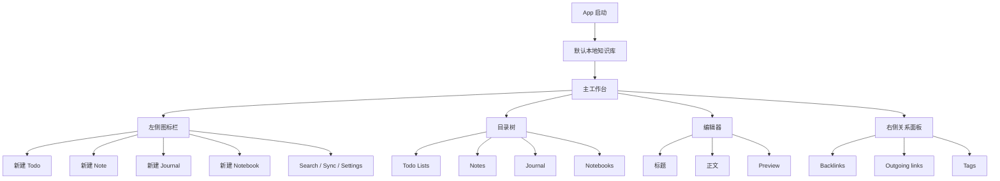

# 高保真 UCD 设计 v0.2

## 1. 设计目标
打造一个本地优先、内容优先、桌面感明确的个人知识库应用。界面不强调“功能说明”，而强调每天打开就能直接写、直接找、直接整理。

## 2. 信息架构



## 3. 当前交互模型

### 3.1 文档模型
每篇文档有两个独立属性：

1. `documentType`
- `note`
- `todo`
- `journal`

2. `notebook`
- 为空：表示未归档，显示在主类型列表中
- 有值：表示已归档到某个 notebook，显示在该 notebook 下

关键规则：
- `Todo / Notes / Journal` 只展示未归档文档。
- 文档移动到 notebook 后，应从原主类型列表中消失。
- 文档从 notebook 移出后，应回到对应 `documentType` 的主列表。

### 3.2 首次使用
1. 打开 App。
2. 自动进入默认本地知识库 `~/Documents/NoteBase`。
3. 如果目录为空，自动初始化知识库结构。
4. 用户看到空状态，并可直接创建第一篇文档。

### 3.3 快速写笔记
1. 点击左侧图标栏中的 `Note / Todo / Journal` 之一。
2. 创建对应类型文档。
3. 编辑区显示独立标题行与正文区。
4. 用户直接输入标题和内容。
5. 系统自动保存，并用旋转图标反馈保存中状态。

### 3.4 归档到 notebook
1. 用户右键某篇文档。
2. 打开 notebook 面板。
3. 选择已有 notebook，或内联新建 notebook。
4. 文档从原主类型列表中消失，并进入目标 notebook。
5. 如果文档中有相对路径附件，路径同步更新。

补充交互：
- 用户也可以从目录树中拖动文档到 notebook。
- 拖拽过程中目标 notebook 需要显示轻量高亮，鼠标旁显示文档名称浮层。
- 拖拽到非 notebook 区域不触发移动，也不应显示系统默认的文件投放状态。
- 如果启动时迁移了旧目录文档，工作台顶部显示一条可关闭的轻量提示，说明迁移数量和来源。
- 设置页 `General` 中展示最近迁移记录，方便用户回看旧目录迁移发生过什么。
- 空目录或空 notebook 的编辑区展示“在这里新建”按钮。

### 3.5 引用另一篇笔记
1. 用户在正文输入 `[[`。
2. 弹出笔记建议面板。
3. 输入关键词筛选。
4. 回车或 Tab 插入引用。
5. 右侧 `Backlinks / Outgoing links` 更新。

## 4. 主工作台

```text
┌────────────────────────────────────────────────────────────────────────────┐
│ 左图标栏 │ 目录树                         │ 编辑器                 │ 关系面板 │
├──────────┼───────────────────────────────┼────────────────────────┼──────────┤
│ Todo     │ Todo Lists (3)                │ 标题                    │ Backlinks│
│ Note     │ Notes (12)                    │                         │          │
│ Journal  │ Journal (4)                   │ 正文编辑区              │ Outgoing │
│ Folder   │ Notebooks (5)                 │                        │          │
│          │   Product                     │ Preview / Save / Tools │ Tags     │
│ Search   │   Research                    │                        │          │
│ Sync     │   Archive                     │                        │          │
│ Settings │                               │                        │          │
│ Trash    │                               │                        │          │
└──────────┴───────────────────────────────┴────────────────────────┴──────────┘
```

## 5. 布局规格
- 左侧图标栏：固定窄栏，只保留图标与悬浮提示。
- 目录树：显示 `Todo Lists / Notes / Journal / Notebooks` 四组。
- 编辑区：默认就是写作区，不暴露“Markdown / Rich text”模式概念给用户。
- 标题与正文分离，但存储时统一回写为 Markdown。
- 右侧关系面板只负责 `Backlinks / Outgoing links / Tags`，不混入同步配置。

## 6. 视觉与交互原则
- 写作面像文档，不像表单输入框。
- 顶层结构连续，不使用大块浮动卡片。
- 图标优先，必要时悬浮提示。
- notebook 菜单和设置面板都应复用同一套安静的面板风格。
- 关系侧栏只展示当前文档上下文，不展示系统说明。

## 7. 组件清单

| 组件 | 用途 | 当前方向 |
| --- | --- | --- |
| IconRail | 左侧创建与全局入口 | 固定图标栏 |
| DirectoryTree | 主类型 + notebook 目录树 | 展开 / 折叠 / 选中 |
| EditorTitle | 独立标题输入 | Markdown 标题回写 |
| EditorBody | 正文编辑 | Markdown-first |
| RelationPanel | Backlinks / Outgoing / Tags | 标签页式切换 |
| GraphView | 真实 note/tag/wikilink 关系图 | 轻量 2D 邻居网络，节点可跳转 |
| MediaLibrary | 附件浏览与反查 | 展示 linked notes，支持 `Unlinked` 过滤、基础排序，以及删除未引用附件 |
| NotebookMenu | 归档到 notebook | 面板式，而非粗糙右键菜单 |
| CommandPalette | 全局搜索与动作 | `Cmd/Ctrl + K`，支持全文搜索与类型 / notebook / tag 过滤 |
| SyncEntry | 顶部同步状态入口 | 图标态 |

补充：
- 当同步存在冲突时，用户点击顶部同步入口应直接进入 `Sync` 设置页，而不是再次盲目执行同步。
- `Sync` 设置页需要展示本地 / 远端快照和逐文件冲突列表，并允许用户逐项选择保留本地或保留远端。

## 8. 空状态

### 空知识库
文案：`这是一个新的本地知识库`
操作：`创建第一篇文档`

### 空 notebook
文案：`这个 notebook 里还没有文档`
操作：`从左侧文档列表归档一篇进来`

### 无搜索结果
文案：`没有找到相关内容`
操作：`继续输入，或创建新文档`

### 搜索过滤
- 搜索面板顶部保留轻量过滤器。
- 文档类型使用分段按钮。
- notebook 和 tag 使用下拉选择。
- 有过滤条件时提供一键清除。

## 9. 设计注意事项
- 当前 UI 已不再使用“收件箱 / projects / topics”作为首屏组织模型。
- 历史测试数据里可能仍存在这些目录，但它们属于遗留结构，不应继续作为主设计语言。
- 当前编辑器以稳定写作优先，富文本增强应晚于基础输入稳定性。
